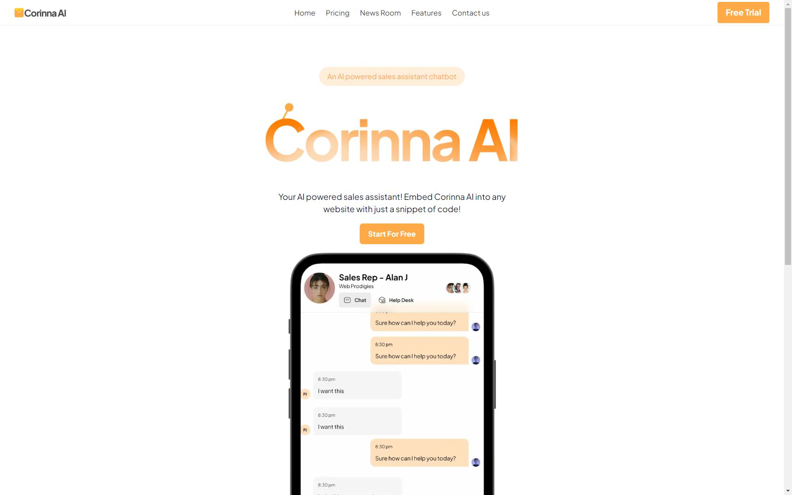

# **Corinna AI: Your Virtual Sales Representative**

Corinna AI is an advanced SaaS platform designed to revolutionize customer engagement and sales processes. Acting as a virtual sales representative, Corinna AI integrates seamlessly with any website, delivering real-time, personalized interactions that enhance user experience and drive conversions. With robust AI capabilities, it adapts to specific business needs, making it an indispensable tool for startups, enterprises, and freelancers.

#

## **Key Features**

- **AI-Powered Content Generation:**
  Quickly create high-quality responses for customer queries, social media, blogs, and emails.
- **Automated Sales Engagement:**
  Interact autonomously with website visitors to guide them through the sales funnel, encouraging actions like bookings and purchases.
- **Customizable AI Models:**
  Fine-tune AI behavior to align with business needs and customer expectations.
- **Smart Question Linking:**
  Context-aware AI connects related questions, providing coherent answers.
- **Secure and Scalable Infrastructure:**
  Protect your data while ensuring seamless performance during high traffic.
- **Real-Time Notifications:**
  Keep track of important events like leads, inquiries, and sales.
- **Performance Analytics:**
  Built-in analytics to track and optimize chatbot and funnel performance.

## **Technologies Used**

- **Frontend:** Next.js, React.js, Tailwind CSS, Shadcn/UI.
- **Backend:** Prisma, PostgreSQL, Neon.
- **Authentication:** Clerk.
- **Integration:** Stripe for payments, Pusher for real-time communication, Uploadcare for file handling.
- **Deployment:** Vercel.

## **Why Choose Corinna AI?**

1. **Generative AI at Its Core:**
   Leverages state-of-the-art Generative AI models to provide intelligent, context-aware responses.

2. **User-Centric Design:**
   Intuitive and customizable interfaces ensure ease of use for businesses and seamless navigation for customers.

3. **Real-Time Engagement:**
   Provides instant responses to visitor inquiries, guiding them through sales funnels and enhancing satisfaction.

4. **Scalable and Secure:**
   Built on a robust backend to ensure secure operations and scalability as your business grows.

**Live Demo**
Explore Corinna AI in action: [Visit Live Demo](https://corinnaai-saas.vercel.app/)

## **Conclusion**

Corinna AI is more than just a chatbot—it’s a comprehensive AI-powered solution to enhance customer engagement, streamline operations, and drive business growth. Join the AI revolution today and elevate your business to new heights!
